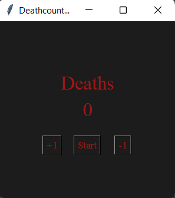

<p align="center">

</p>

# deathcounter_ocr

A python script which detects death messages for Elden Ring by using **O**ptical **C**haracter **R**ecognition.
The number of deaths is then displayed in a graphical user interfaces. The number of deaths is saved between sessions. <br/>
The deathcounter doesn't interact with the game in any way and is therefore **compatible** with **online play**. <br/>
The deathcounter can be used for counting your deaths while livestreaming or just for yourself. <br/>
In my tests there was **no noticable performance impact**.

**It is also very easy to adapt the script to a different game using the additional scripts provided in this repository. For detailed instructions see below.**

<br />


---

# How does it work?

Every 0.3 seconds the script takes a screenshot of your screen. The image gets cropped so that it only consists of the part of the screen where the death message appears. A mask corrosponding to the color of the death message gets generated. The mask is turned grayscale. After that the black and white values get filtered to be more readable for the OCR Algorithm. Two alternative versions of the image with one half of the image filled with black pixels are generated (left / right). This provides additional variants with less noise for the OCR algorithm to process. The processed images are then passed to the OCR algorithm, which scans the images for text. The levensthein distance between the found words and the death message gets calculated. If the distance is small enough the counter gets incremented.

# Requirements:

_The following installation guide is made with Windows in mind. If you use Linux I believe you will have no problem to get the script working even if the guide is made for windows._

## 1) Install Python 3 and PIP

As this is a python script you need a **working python installation** on your machine. <br/>
You can install the required version of python 3 from the [official website](https://www.python.org/downloads/) or download it from the microsoft store which is **easier** as it also installs **pip**. If you get python from the website you have to install pip seperately [(guide)](https://www.geeksforgeeks.org/how-to-install-pip-on-windows/).

## 2) Install Tesseract OCR

Install a version of **Tesseract OCR** [(UB-Mannheim)](https://github.com/UB-Mannheim/tesseract/wiki) or [(Main Repository)](https://github.com/tesseract-ocr/tesseract) <br/>
Install the language package you want to use. To use the preconfigured script download the english package. Detailed explanations for changing the language of the detected death message below.

## 3) Install required pip libraries

```console
pip install pytesseract
```

```console
pip install PyAutoGUI
```

```console
pip install opencv-python
```

## 4) Change set location of Tesseract OCR installation

In **config.json** you have to change the path to tesseract.exe so that it matches the setup on your machine("tesseract_directory": "YOUR_PATH"). Remember to double every \

---

# Usage

Use the following command while having a Command Line Interface open in the directory the script is located:

```console
python deathcounter.py
```

or:

```console
py deathcounter.py
```

**_Don't forget to start the counter by clicking on the start button_**

If you want to show the counter while streaming you just have to add the window which displays the counter as a source in OBS.<br/>
If you want to reset the counter without spamming -1, you can just change the value of **deaths.txt**, which is located in the same directory as the script<br/>

---

# config.json

| Name                    | Value             | Usage                                                                                                                         |
| ----------------------- | ----------------- | ----------------------------------------------------------------------------------------------------------------------------- |
| "tesseract_directory":  | directory path    | Use this to set the path to the directory your tesseract.exe is installed in                                                  |
| "refresh_time":         | time in ms        | Use this to configure the time the program waits between taking screenshots. Lower values lead could lead to better detection |
| "refresh_time_success": | time in ms        | Same as above but only gets used if a match is successfully detected                                                          |
| "debug_mode":           | enabled/disabled  | Will print debug messages to console and output images for debugging to debugImages\images if enabled                         |
| "compact_mode":         | enabled/disabled  | Will remove all elements of the counter except the number of deaths from the display window if enabled                        |
| "crop_file":            | name/path to file | Use to set the file which contains coodinates where image gets cropped (Standard: crop.json)                                  |
| "mask_file":            | name/path to file | Use to set file which contains the merged masks, which you want to use for generating your masks in deathcounter.py           |
| "ocr_string":           | matched string    | Use to set the String / Word you want the script to look for                                                                  |
| "language":             | language code     | Use this to set the language you want Tesseract to use (needs language packet installed with Tesseract)                       |

---

# Additional scripts

The debugImages folder contains three additional python scripts:<br/>

## cropimage.py

This script can be used to export the coordinates you want to use to crop the screenshot. You can change the config to match the exported file to change where the screenshot gets cropped. <br/>
Files are exported to debugImages/crops <br/>

Usage:

```console
python cropimage.py <input file> <output file name>
```

1. **Left click** on the uppper left corner of the part you want to crop <br/>
2. **Right click** on the lower right corner of the part you want to crop <br/>
3. Crop coodinates get exported to debugImages/crops <br/>

## maskgenerator.py

This script can be used to generate color masks which can be used in deathcounter.py to generate a complete mask which matches the death message. <br/>

Colormasks have the following format: {"lower": [166, 151, 50], "pixel": [176, 161, 90], "upper": [186, 171, 130]}. <br/>
Lower and upper are fluctuations around the pixel color value. This is done to select a bigger colorspace and caputure a "wider" color mask. This can also be helpful if the text has an alpha value applied to it like the text in Elden Ring. You can configure the fluctuations in maskgenerator.py on line 61 and 62. <br/>

Files are exported to debugImages/generatedMasks <br/>

Usage:

```console
python maskgenerator.py <input file> <output file name> <number of exported masks>
```

1. **Left click** on the part of the image that you want to make a mask of
2. Inspect the opened windows which showcases what your mask would match
3. Either confirm the export by **rightclicking** the mask image or **close the window** and start at step one again
4. If you want to export a bigger number of masks repeat from step one

The files can be imported into deathcounter.py by selecting them through the config. The files of multiple images still have to be merged by using maskmerger.py.

## maskmerger.py

This script can be used to merge the masks generated for specific images into one completed json file you can use for deathcounter.py by selecting it in config.json <br/>
Files are exported to debugImages/completedMasks <br/>

Usage:

```console
python maskmerger.py <output file name> <input file1> <input file2> <...>
```

---

# How to adapt the counter to a different game

With the scripts mentioned above it is possible to adapt the deathcounter script to work with any game that has a death screen if you follow these steps:

1. Take a screenshot of the "death screen"
2. use cropimage.py to export a file which contains the right coordinates to crop the image so that it includes the "death message" and change the config file accordingly
3. Use maskgenerator.py and optionally maskmerger.py to generate the matching mask files for your death message and change the config file accodingly
4. Change ocr_string in the config to match the one displayed in your death message
5. You may have to change the "refresh_time_success" parameter in the config to a higher number, if the game displays the message for longer. If you don't it could lead to 2 or more detections of one death message

# How to adapt the counter to a different language

**If you adapted the script to a different game or language please feel free to submit a pull request to add your configs to this repository and maybe help out other people**

There is a preconfigured config for the german version of Elden Ring in the alternativeConfigs/Games/Elden Ring folder which you can use.

1. Install the needed Tesseract language package
2. Change the image crop coordinates to fit the message
3. Change the config parameter "language" so that it matches the language code of the language you want to use
4. Change the "ocr_string" parameter in the config to match the shown death message
5. Change the the levensthein distance so that it is proportionate to your word (levensthein distance is the difference between two strings, if you have a long string you may have to change it to a lower value)

**_Tesseract supports many languages, here are some examples of the language codes that you can use:_**

| Code | Language |
|-----|---------|
| eng | English |
| spa | Spanish |
| fra | French  |
| deu | German  |

You can find a full list of language codes that are supported by Tesseract in the tessdata repository on [GitHub](https://github.com/tesseract-ocr/tessdata)

# Known Limitations

Sometimes the detection goes wrong, for this reason you can change the counter by changing the content of the deaths.txt file or use the integrated button to manually change the value. <br/>

The script only works if you use the resolution 1920x1080. If you use a different resolution you have to change the image crop coordinates, which can be configured by using the python script provided in debugImages\ and the config to crop out the correct part of the screen. <br/>

Preconfigured version only works with the english version of Elden Ring. But the script can be adapted to any language and any game that has a identifiable text as a death message. <br/>

---

# Privacy Notice

We respect the privacy of our users and understand the importance of protecting their personal information. This is why we want to assure you that our program does not collect any data about its users.

You can use our program with confidence, knowing that we do not store or share any information about you, your device, or your use of the program. We believe that your privacy is a fundamental right and we are committed to respecting it.

If you have any questions or concerns about privacy and security, please don't hesitate to contact us.

# Licensing

This software depends on Tesseract OCR, an open source optical character recognition engine.
Tesseract OCR is distributed under the Apache License 2.0.
More information about Tesseract OCR can be found at https://github.com/tesseract-ocr/tesseract.

Copyright 2023 Jan-9C

This program is free software: you can redistribute it and/or modify
it under the terms of the GNU General Public License as published by
the Free Software Foundation, either version 3 of the License, or
(at your option) any later version.

This program is distributed in the hope that it will be useful,
but WITHOUT ANY WARRANTY; without even the implied warranty of
MERCHANTABILITY or FITNESS FOR A PARTICULAR PURPOSE.  See the
GNU General Public License for more details.

You should have received a copy of the GNU General Public License
along with this program.  If not, see <https://www.gnu.org/licenses/>.
